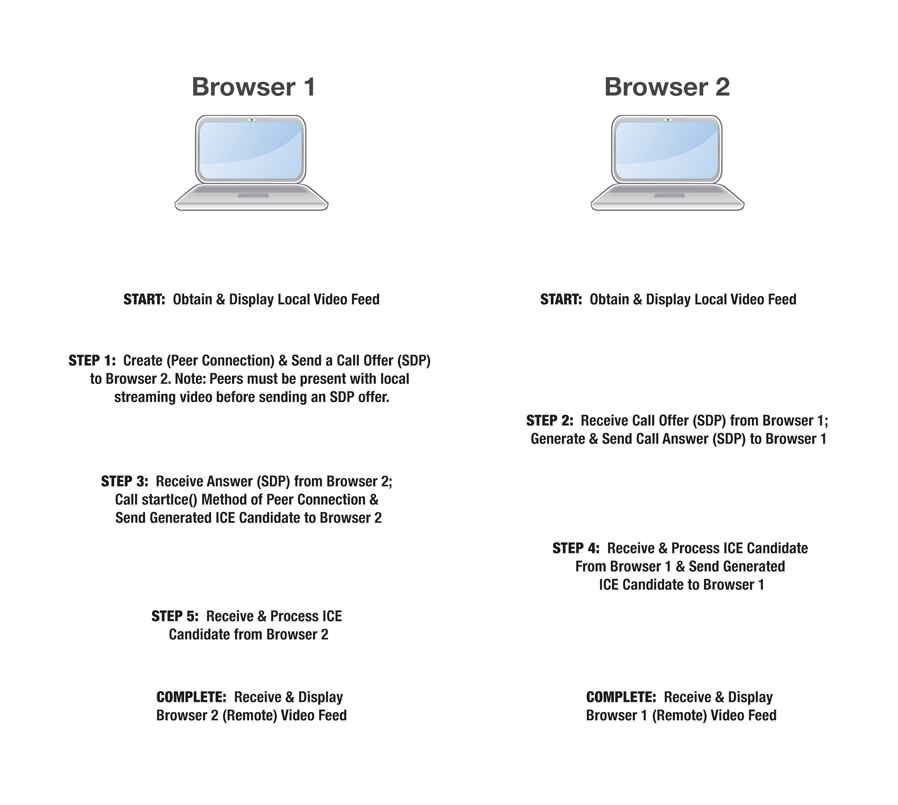

# webrtc-demo
webrtc 演示示例，在线[预览地址](https://nashaofu.github.io/webrtc-demo/)

## 使用说明

1. 生成ssl
```bash
mkdir ssl

cd ssl

openssl genrsa -des3 -passout pass:x -out server.pass.key 2048

# writing RSA key
openssl rsa -passin pass:x -in server.pass.key -out server.key

rm server.pass.key

openssl req -new -key server.key -out server.csr

openssl x509 -req -sha256 -days 365 -in server.csr -signkey server.key -out server.crt
```

2. 安装依赖启动服务
```bash
yarn

yarn start
```

3. 在浏览器中打开终端输出的地址
4. index.html是使用复制文本握手的示例，http.html是使用http建立连接的示例，socket.html是用来演示socket建立连接的示例

## webrct握手流程

交换offer和iceCandidata通常通过socket来交换，目的是方便对方网络情况变化后能够推送到参与会话的人，其实这个交换过程也可以用其他任何方式，只要能相互交换信息就可以。例如，A创建会话后，把自己的offer和iceCandidata通过邮件发送给B，B把这些信息设置到自己的会话中，然后把自己的offer和iceCandidata发送给A，只要在这期间网络状况没发生变化，就能够正常通话


## MDN webRTC连接流程


