# webrtc-demo

webrtc 演示示例，可在[预览地址](https://www.nashaofu.com)直接使用，或者在[https://nashaofu.github.io/webrtc-demo/](https://nashaofu.github.io/webrtc-demo/)查看基本显示效果，项目更多介绍可在公众号[代码骑行与美食](https://mp.weixin.qq.com/s/0C9jWmiiUisziAntgJLn1g)中查看

webrtc更多介绍：https://mp.weixin.qq.com/s/VQwvyaitC1L8noIq5Bnwjw

## 使用说明

1. 生成 tls 证书

```bash
mkdir tls

cd tls

openssl genrsa -des3 -passout pass:x -out server.pass.key 2048

# writing RSA key
openssl rsa -passin pass:x -in server.pass.key -out server.key

rm server.pass.key

openssl req -new -key server.key -out server.csr

openssl x509 -req -sha256 -days 365 -in server.csr -signkey server.key -out server.crt
```

2. 双击`tls/server.crt`安装 tls 证书到系统，然后信任该证书。具体参考：https://blog.csdn.net/cuk0051/article/details/108319531

3. 安装依赖启动服务

```bash
yarn

yarn start
```

4. 在浏览器中打开终端输出的地址，如遇到证书安全问题可参考https://blog.caojun.xyz/posts/macos_trust_ssl/
5. index.html 是使用复制文本握手的示例，http.html 是使用 http 建立连接的示例，socket.html 是用来演示 socket 建立连接的示例

## webRTC 连接建立流程



交换 offer 和 iceCandidata 通常通过 socket 来交换，目的是方便对方网络情况变化后能够推送到参与会话的人，其实这个交换过程也可以用其他任何方式，只要能相互交换信息就可以。例如，A 创建会话后，把自己的 offer 和 iceCandidata 通过邮件发送给 B，B 把这些信息设置到自己的会话中，然后把自己的 offer 和 iceCandidata 发送给 A，只要在这期间网络状况没发生变化，就能够正常通话。关于 webRTC，[这篇文章](https://juejin.im/post/5dcb652cf265da4d194864a3)讲得比较不错。

## MDN webRTC 连接流程介绍


